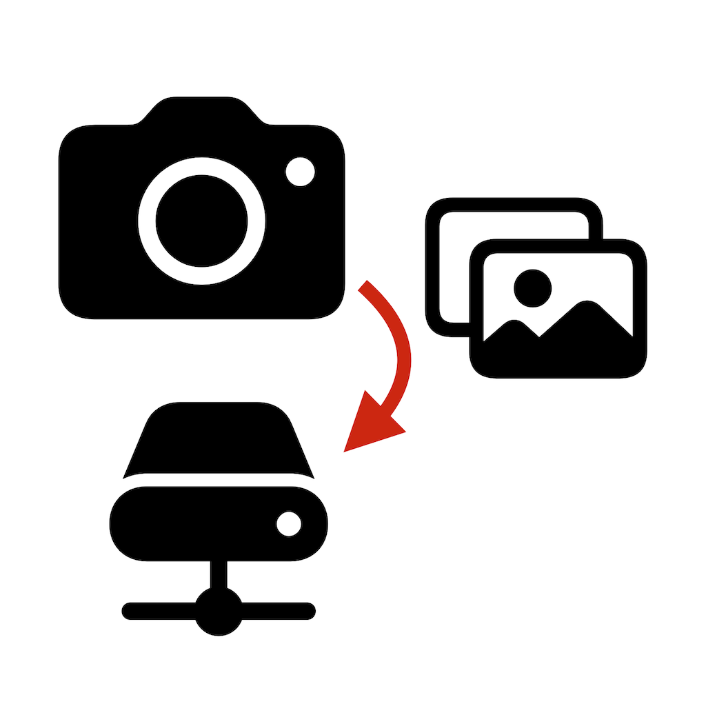

# Camera » NAS

This is the support web site for the (closed-source) "Camera » NAS" iOS app.

## Support 
Please use the [issues tab](https://github.com/g-mocken/cam2nasSupport/issues) to report any problems or ask for features.

## Data privacy
Images can be temporarily cached on the iOS device, but are erased immediately after the transfer.
If the local file system is used as image transfer destination, then only basic app preferences are stored on the iOS device itself. If a Synology NAS is used as image transfer destination, then the corresponding login credentials also are stored.

All preferences are stored as User Defaults, which means that they are part of your ordinary device backup. Consequently, data security depends on your selected backup scheme (iCloud, local-unencrypted, local-encrypted).
It also means that on-device security relies on iOS sandboxing and general iOS file system encryption, and that it does not meet higher standards such as the iOS keychain.

The credentials are only used to login to your private NAS device, usually via encrypted HTTPS connection. Unencrypted HTTP is only available in local networks because of Apple's "App Transport Security" (ATS) restrictions. They are not sent to any other server than the one (your NAS) that you specify.

However, if Synology QuickConnect and/or Synology relay servers are used then data privacy basically depends on [Synology's data privacy policy](https://www.synology.com/en-us/company/legal/privacy). 
